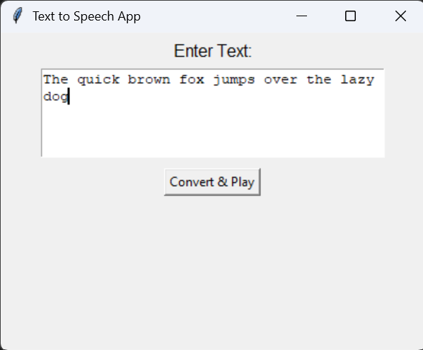

# Voice your words with a minimalist interface with smooth n' clear output

## Using Google's Text-To-Speech library 'gts'

`but it has only female voice`

So, as an alternative:

## Using Python's Text-To-Speech library 'pyttsx3'

> which provides both: female and male voices

---

## Working Sample:

[Listen the audio here](https://one-at-a-time.github.io/Voicer/)

---
