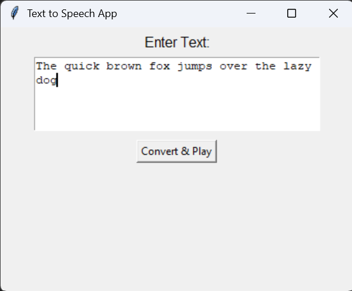

# Voice your words with a minimalist interface with smooth n' clear output

## Using Google's Text-To-Speech library 'gts'

`but it has only female voice`

So, as an alternative:

## Using Python's Text-To-Speech library 'pyttsx3'

> which provides both: female and male voices

---

## Working Sample:

[sample audio](https://github.com/user-attachments/assets/c3758d42-0fa9-4ded-9e1e-657146a75ab5)

---
